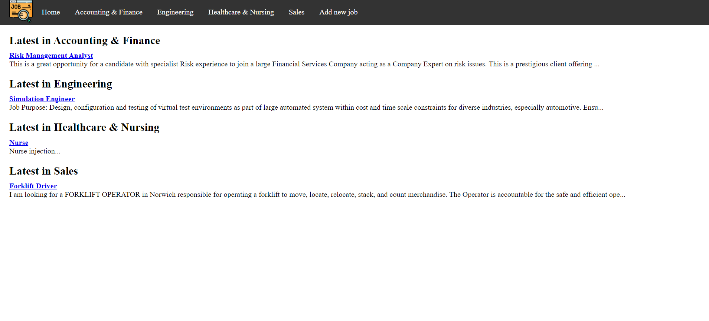
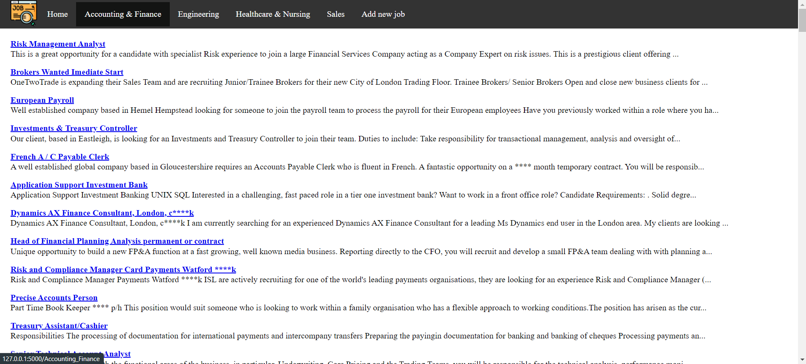
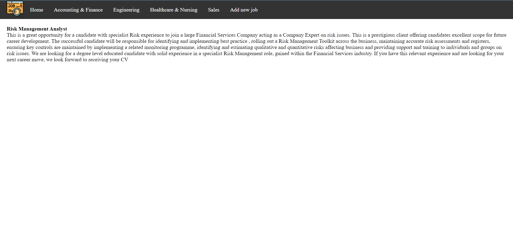
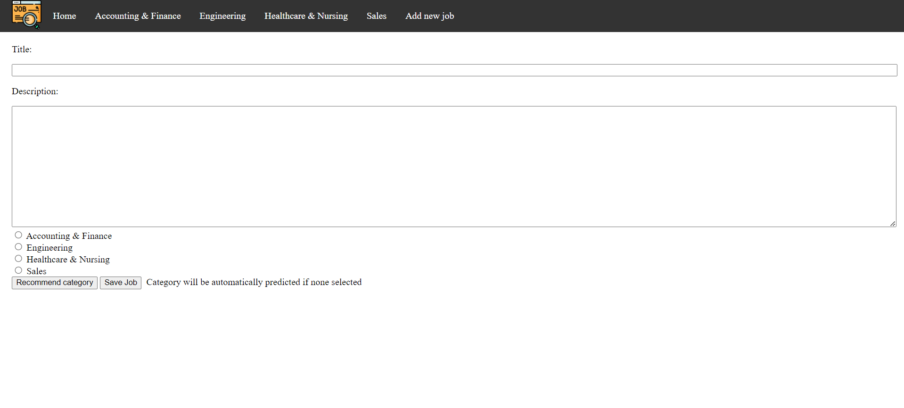
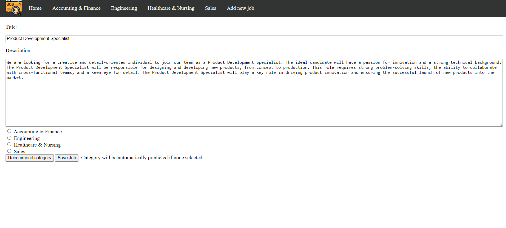

# Job Data Wrangling, Analysis & Visualization
Task 1: System to parse, cleanse and integrate XML data
Task 2: End to end system from ETL to training a classification model to visualizing the data

# What I Learned
## Task 1 - Data Parsing & Cleansing
- Extract data from XML files using Python Libraries i.e. xml.etree.ElementTree
- Parsing data into required format
- Cleansing & Parsing categorical & numerical columns
- Data Cleansing & Parsing using RegEx
- Integrating multiple datasets
- Resolve conflicts during data integration

## Task 2 - Data Analysis
- Generate Unigrams from textual data
- Preprocess textual data including tokenisation, stop words removal etc.
- Generate feature representations of textual data
 - Count Vector Representation
 - TF-IDF weighted vector representation
 - Unweighted vector representation
- Build a Logistic Regression language model from the feature representations

## Task 3 - Data Visualization
- Host websites using Python Flask
- Run trained language model using Flask to the website
- Visualize data on the web interface
- Allow data insertion through the web interface
- HTML & CSS & JQuery

# Web Interface Demonstration
## HomePage
<kbd>
  
</kbd>

## Category-specific Job Listings
<kbd>
  
</kbd>

## Job Details
<kbd>
  
</kbd>

## Job Form
<kbd>
  
</kbd>

## Category Recommendation
<kbd>
  
</kbd>

## Save Jobs
<kbd>
  
</kbd>
